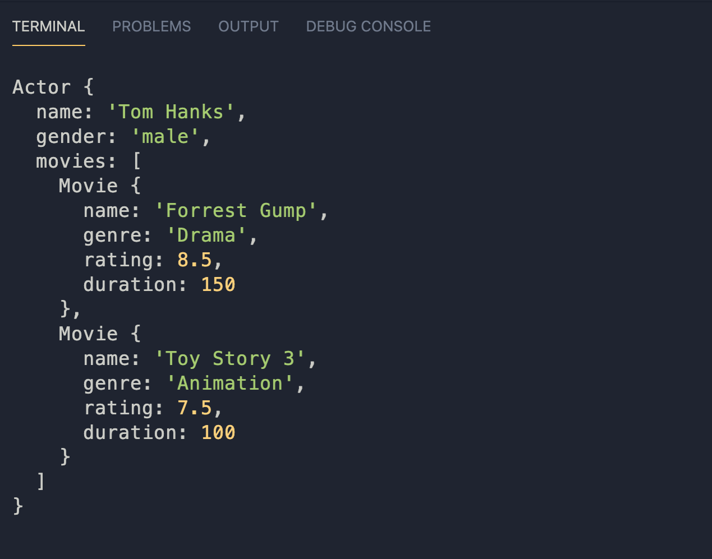
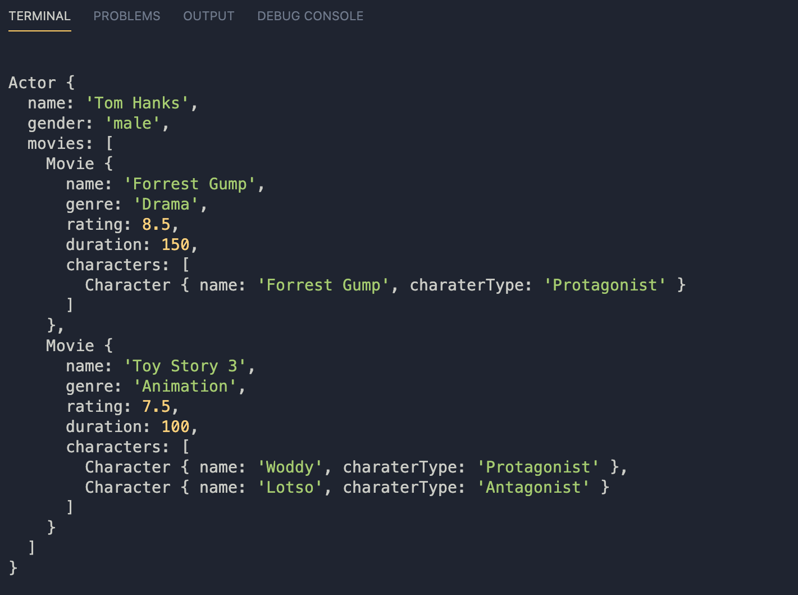

# Review OOP Part 2
- Aggregation  
- Composition  
- Factory Method
- fs

<details> 
<summary>🙋🏻‍♀️ 🙋🏻 Yang mana Aggregation & Composition?

```diff
A. Pokemon & Trainer (Pikachu & Ash)
B. Pokemon & Movement (Pikachu & Thunderbolt)
C. Movie & Character (Spider-Man  & Peter Parker)
D. Movie & Actor (Spider-Man  & Tom Holland)
```
</summary>
Answer

```diff
+ Aggregation : A & D
A. Pokemon & Trainer (Pikachu & Ash)
D. Movie & Actor (Spider-Man  & Tom Holland)
```
```diff
+ Compositon : B & C
B. Pokemon & Movement (Pikachu & Thunderbolt)
C. Movie & Character (Spider-Man  & Peter Parker)
```
 Aggregation 
 - ( Movie & Actor ) movie akan tetap ada walaupun actornya tidak.  
 case spiderman actornya udah diganti 2 kali 👀

 Compostion 
 - (Movie & Chacter) jika tidak ada film spiderman maka kita gak kenal dengan peter parker,<br>
 sama halnya ke movie atau cartoon lain. Tidak tahu dengan sama Pikachu kalo tidak ada Pokemon
</details>


# Realese 1
buat class untuk **Movie** dengan property `name, genre, rating & duration`.
</br>

buat class **Actor** dengan property `name, gender, movies`.  
property movies pada actor merupakan kumpulan movie yang dia perankan.

Buat **method inputMovie** pada Actor: 
- `inputMovie` yang berfungsi untuk menambahkan isi property movies (movie yang dia perankan)




# Realese 2
Buat **class Character** dengan property `name & characterType`.  
Tambahkan `property characters` pada class Movie & `method untuk menambahkan character` ke movie tersebut.
<details> 
  <summary>🙋🏻‍♀️ 🙋🏻</summary>

  BUAT `method` yang menambahkan character secara satu persatu.
</details>


<details> 
  <summary>
    Sehingga kalo sekarang kita console.log variable yang merupakan instance Actor bentuknya seperti ini ⬇️
  </summary>


saat object atau array terlalu dalam maka bentuknya akan di singkat oleh JS 😅😅
- Reference util.inspect untuk melihat object lebih dalam
</details>


# Realease 3 
Kita akan membuat Factory Method tapi sebelum itu seharusnya terdapat class untuk : 
- AnimationMovie
- DramaMovie 

> Setiap nama class sudah mewakili genre movie.
>
> DramaMovie memiliki property `basedOn` dengan value string.  
> `basedOn` berfungsi untuk yang memberitahu film tersebut merupakan kisah nyata,  
> namun jika tidak bukan maka value adalah `'Fiction'`

```js
[
  AnimationMovie {
    name: 'Toy Story 4',
    genre: 'Animation',
    rating: 7.8,
    duration: 100,
    characters: []
  },
  DramaMovie {
    name: 'Parasite',
    genre: 'Drama',
    rating: 8.8,
    duration: 165,
    characters: [],
    basedOn: 'Fiction'
  },
  DramaMovie {
    name: 'Bohemian Rhapsody',
    genre: 'Drama',
    rating: 8,
    duration: 133,
    characters: [],
    basedOn: 'Freddie Mercury'
  },
]
```

<details> 
  <summary>
    Inheritance 👨‍👩‍👧‍👧
  </summary>


</details>

<details> 
  <summary>
    Factory Method dengan file movies.txt & characters.json 👨‍👩‍👧‍👧
  </summary>


</details>

# Realese 4 
Membuat method untuk mencari movie dengan waktu kurang dari input

